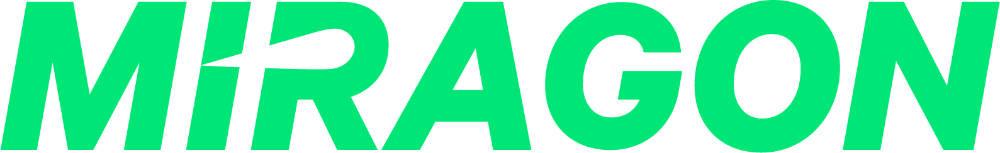

<!-- PROJECT LOGO -->
 

  

<h3 align="center">Miragon <i>vs-code-templates</i></h3>

  

    <i></i>
     <a href="https://github.com/FlowSquad/vs-code-templates/issues">Report Bug</a>
  

<!-- ABOUT THE PROJECT -->
## About The Project

In this repository you will find several templates that will help you to start your own project building
a vs code extension.

(<a href="#top">back to top</a>)

## Getting started

Download a template adjust the package.json to your needs and start developing.

(<a href="#top">back to top</a>)

